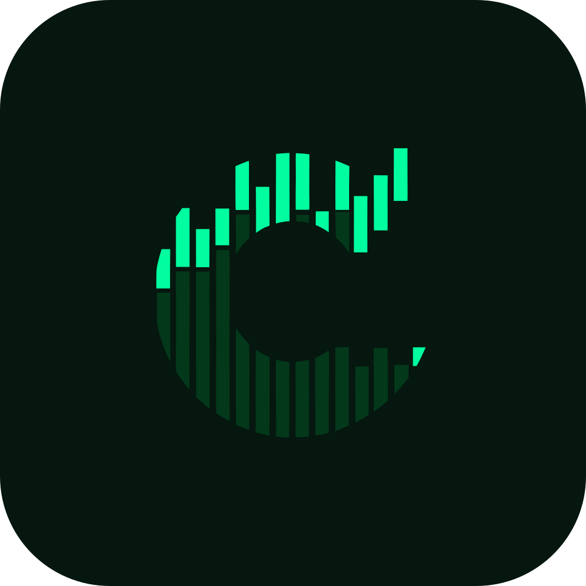

<h1 align="center">
 
CryptoLens
</h1>
<h3 align="center">A clean, modern, and distraction-free cryptocurrency monitoring dashboard </h3>

<h1 align="center">

 

</h1>

> [!WARNING]  
> **Not Financial Advice:** CryptoLens is strictly a cryptocurrency monitoring dashboard. It does not facilitate trading, host blockchain data, or provide financial advice.
>
> **No Liability:** Users are solely responsible for their financial decisions. The developer assumes no liability for data inaccuracies, financial losses, or misuse of the application.
>
> **Regional Restrictions:** The app relies on Binance WebSockets for real-time price updates. Users in restricted regions (such as the US) may experience connection errors and are responsible for complying with their local regulations.

## 💖 Support Us

> [!TIP]
> ⭐ **Star This Repository To Support The Developer And Encourage The Development Of CryptoLens!**

## Description

**CryptoLens** is the React Native rewrite of the popular CryptoLens web dashboard. It brings the same elegant, terminal-inspired experience to your phone with real-time market data, beautiful charts, and a premium dark-green UI optimized for mobile.

Track live prices, discover trending coins, analyze market sentiment, and monitor global metrics — all in a fast, native mobile app.

## Downloads

  
  
   
  

> [!NOTE]
> For direct APK downloads, setup guides, and QR codes to scan on your computer, check out the official [Downloads Page](https://cryptolens.link/downloads).

## Features

- **Live Prices:** Real-time updates via Binance WebSockets for hundreds of pairs.
- **ETF Flow Tracking:** Historical and daily net flow data for BTC and ETH ETFs.
- **Market Sentiment:** Integrated Fear & Greed Index to gauge market psychology.
- **Market Insights:** Trending, Gainers, and Global metrics at a glance.
- **Interactive Charts:** Optimized sparklines and Global Market history visualization.
- **Top 100 Assets:** Fluid, sortable market tracking with deep linking.
- **Native Performance:** Optimized UI with NativeWind v5 and Shopify FlashList.
- **Serverless Backend:** High-performance Cloudflare Worker proxy with KV caching.

## Tech Stack

- **React Native** (Expo 56)
- **TypeScript**
- **NativeWind v5** (Tailwind CSS v4)
- **Zustand** (Global state management)
- **TanStack Query**
- **Cloudflare Workers & KV** (Hono)
- Data from **Binance**, **CoinGecko**, **SosoValue**, and **CMC**

## Contributing

Contributions of all kinds are welcome! Whether you want to fix bugs, add new features, improve documentation, or translate content.

To get started:

1. **Explore the Docs**: Want to understand the architecture, project structure, or how to set up the serverless backend? Check out our official documentation:

   

2. **Submit a Pull Request**: Check out the codebase, make your improvements, and submit a PR!

## 🗺 Roadmap

- [x] **Global Search:** Full-text search for thousands of assets with live price syncing.
- [x] **Market Sentiment:** Fear & Greed Index integration.
- [ ] **Coin Details:** Charts, history, and project info.
- [ ] **Portfolio Tracker:** Securely monitor your holdings.
- [ ] **Price Alerts:** Instant custom push notifications.
- [ ] **Crypto Calendar:** Track ICOs and major events.
- [ ] **App Store Release:** Optimized iOS & Android builds.

## License

This repository is licensed under AGPL-3.0.

---

Made with ❤️ by zedxihan
